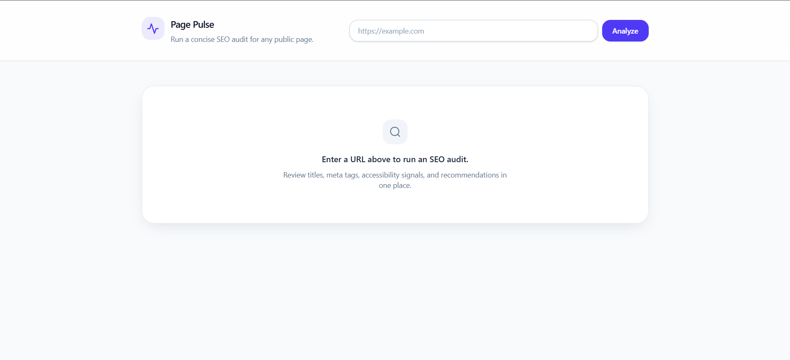
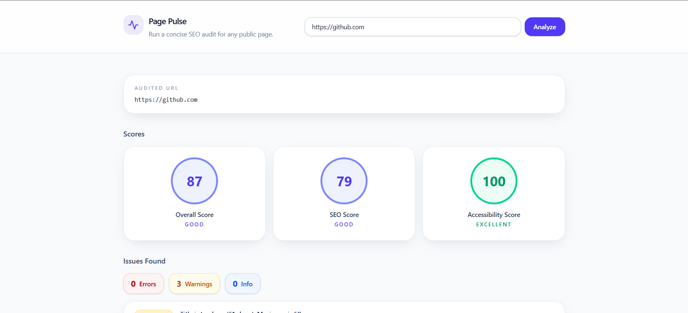
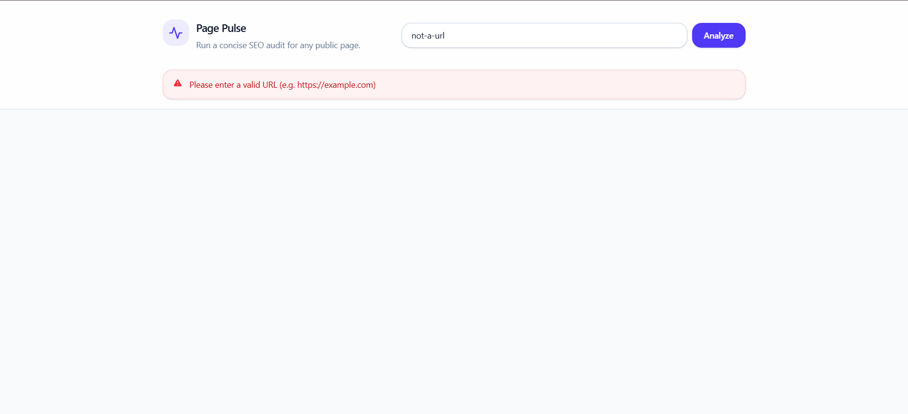

# Page Pulse

A lightweight web application that audits any public webpage and generates a concise technical and SEO report.

Users simply enter a URL, and the application fetches the page, analyzes its HTML, and returns useful metrics such as page metadata, heading structure, accessibility issues, response information, and content statistics.

This project was built as part of the **Digital Heroes Software Development Internship Qualification Task**.

---

## Live Demo

- **Frontend:** [<VERCEL_URL>](https://page-pulse-pearl.vercel.app/)
- **Backend API:** [<RENDER_URL>](https://page-pulse-backend-jrek.onrender.com)

---

## Features

### Backend

- Fetches and analyzes any publicly accessible HTML page
- Returns the following insights:
  - HTTP status
  - Response time
  - Page title
  - Meta description
  - H1 count
  - Images missing alt text
  - Approximate word count
- Detects invalid URLs
- Handles request timeouts gracefully
- Rejects non-HTML responses
- Provides structured API error responses
- Validates input using Zod

### Frontend

- Offers a clean and responsive interface
- Validates URLs before submission
- Displays loading and error states
- Presents audit results through organized metric cards
- Includes an accessibility-focused UI
- Supports desktop and mobile layouts

---

## Tech Stack

### Frontend

- React
- TypeScript
- Vite
- Tailwind CSS
- Axios
- Vitest

### Backend

- Node.js
- Express
- TypeScript
- Cheerio
- Zod
- Vitest

---

## Project Structure

```text
page-pulse/
├── backend/
│   ├── src/
│   ├── tests/
│   └── ...
├── frontend/
│   ├── src/
│   ├── components/
│   └── ...
└── README.md
```

---

## Architecture

The application follows a layered architecture to keep responsibilities separated.

```text
Client
  │
  ▼
Frontend (React)
  │
  ▼
Express API
  │
  ▼
Audit Service
├── Page Fetcher
├── HTML Parser
├── Page Analyzer
├── Scoring Engine
└── Recommendation Engine
```

Each layer performs a single responsibility, making the project easier to maintain and test.

---

## API

### POST /api/v1/audit

Audits a webpage.

### Request

```json
{
  "url": "https://example.com"
}
```

### Successful Response

```json
{
  "success": true,
  "data": {
    "...": "Audit data returned here"
  }
}
```

### Possible Errors

- 400: Invalid URL
- 408: Request Timeout
- 415: Non-HTML Response
- 500: Internal Server Error

---

## Running Locally

### Clone

```bash
git clone https://github.com/aniruddh-batwal07/page-pulse
cd page-pulse
```

### Backend

```bash
cd backend
npm install
cp .env.example .env
npm run dev
```

### Frontend

```bash
cd frontend
npm install
cp .env.example .env
npm run dev
```

---

## Environment Variables

### Backend

| Variable | Description |
| --- | --- |
| PORT | Express server port |
| HOST | Host interface |
| REQUEST_TIMEOUT_MS | Maximum page fetch timeout |
| CORS_ORIGIN | Allowed frontend origin |

### Frontend

| Variable | Description |
| --- | --- |
| VITE_API_BASE_URL | Backend API URL |

---

## Testing

### Backend

```bash
cd backend
npm test
```

### Frontend

```bash
cd frontend
npm test
```

The project includes tests covering:

- HTML parsing
- API endpoints
- Failure scenarios
- Frontend components
- User interactions

---

## Design Decisions

### 1. Layered Backend Architecture

The backend separates fetching, parsing, analysis, scoring, and recommendation generation into independent modules. This keeps each component focused on a single responsibility, improves maintainability, and makes individual layers easier to test.

### 2. Schema-Based Validation

All incoming requests are validated using Zod before reaching the business logic. This prevents invalid input from propagating through the application and enables consistent error responses.

### 3. Robust Error Handling

Instead of allowing runtime failures to surface as generic server errors, the application explicitly handles invalid URLs, network failures, request timeouts, and non-HTML responses. This provides predictable API behavior and a better user experience.

---

## Deployment

The application is deployed using free-tier cloud platforms.

- **Frontend:** Vercel
- **Backend:** Render

Configuration is managed using environment variables to keep runtime settings separate from the application code.

---

## Future Improvements

Given additional time, I would extend the project with:

- Lighthouse-style performance metrics
- Additional SEO checks such as Open Graph, canonical URLs, and robots meta tags
- Historical audit reports
- Exporting reports as PDF
- Authentication and saved audits
- Background job processing for long-running audits

---

## Screenshots

### Home



### Audit Report



### Error Handling



---

## Loom Demo

Loom walkthrough:

[<LOOM_LINK>](https://drive.google.com/file/d/1d8jjyAvPZ69BW0Xta07QdAMXNtPEU1Rp/view?usp=sharing)

The demo covers:

- Project overview
- Live application walkthrough
- Architecture overview
- Design decisions
- One improvement I would implement with more time

---

## Design Notes

This project was intentionally designed with a clear separation of concerns, strong input validation, comprehensive error handling, and modular architecture. The goal was to produce a maintainable application rather than simply satisfy the minimum functional requirements.

---

## AI Usage

AI tools (primarily ChatGPT and GitHub Copilot) were used to accelerate development, clarify implementation approaches, review architecture, and identify potential edge cases. I did not use AI output directly without review. I iterated on the generated code, refined the project structure, improved the UI, added production configuration, completed the missing assignment requirements (such as the live-build footer and approximate word count), expanded the test coverage, and verified the final implementation before deployment. All design decisions, integration, debugging, and final review were completed by me.

---

## License

This project was created for the Digital Heroes Software Development Internship Qualification Task.